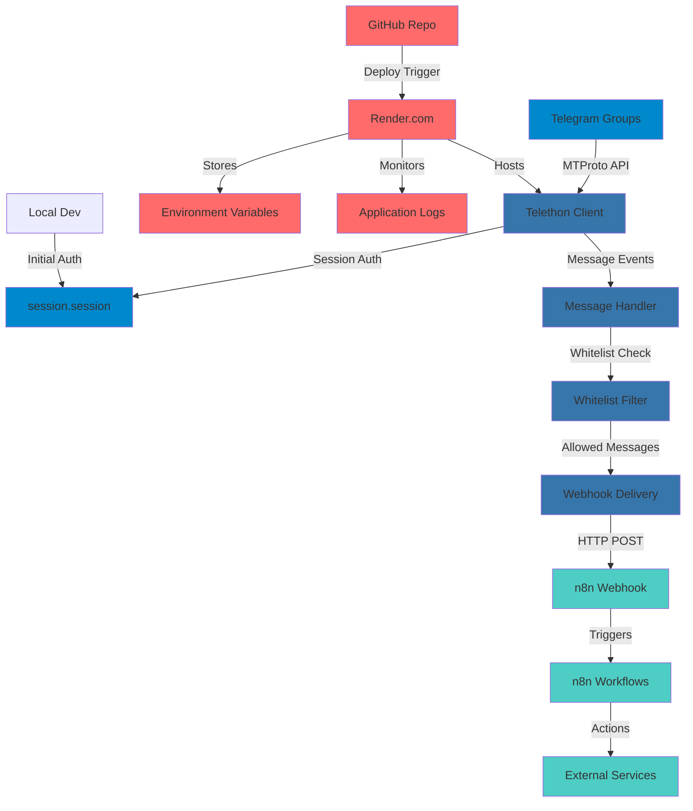
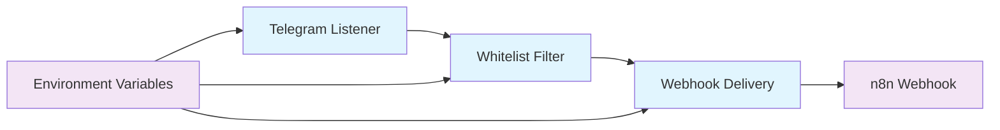
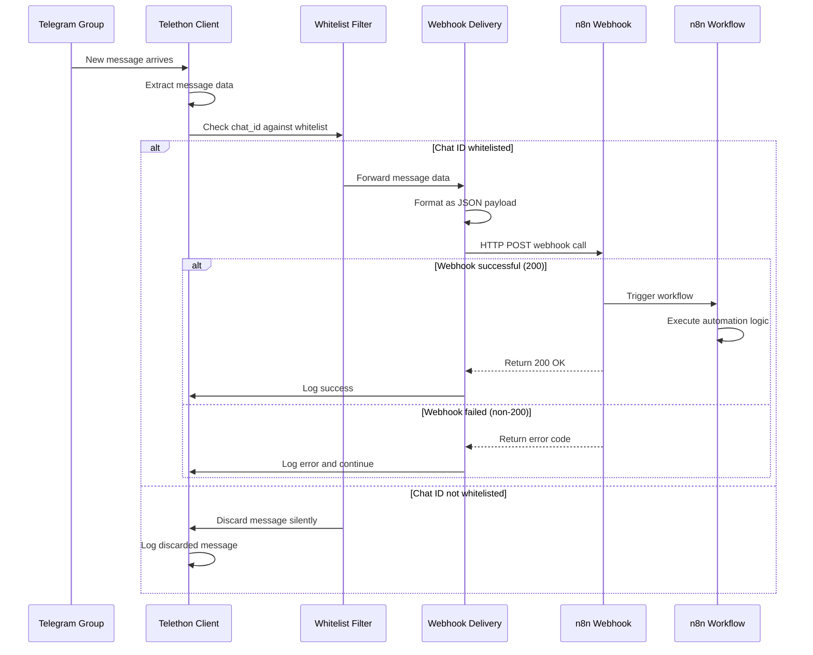
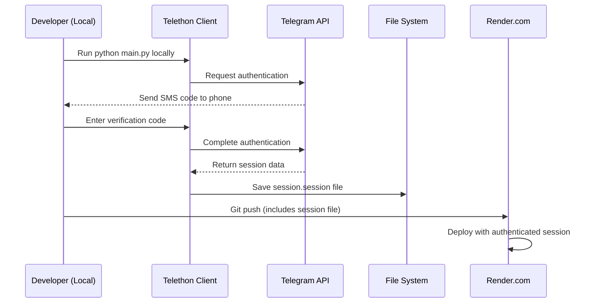
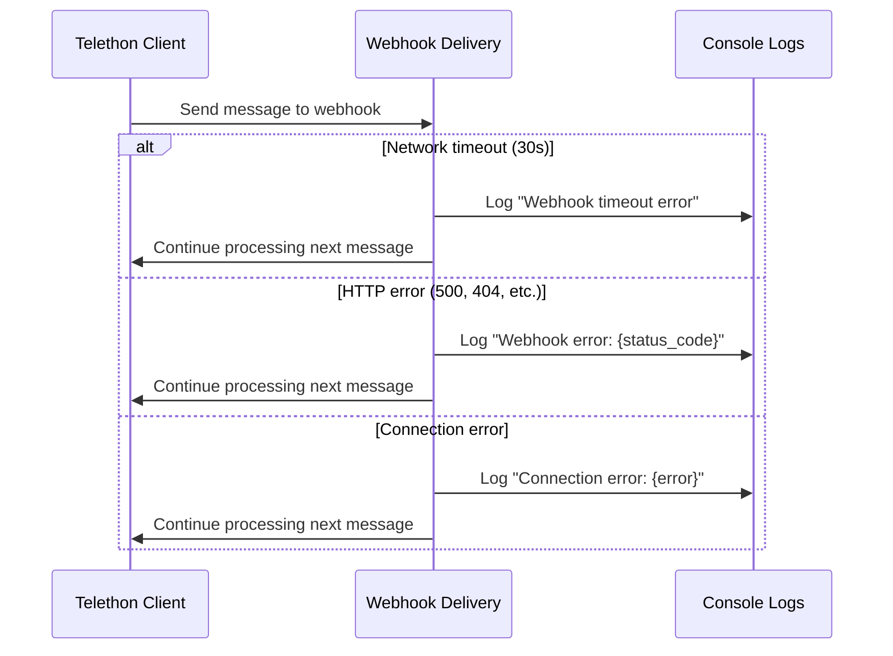
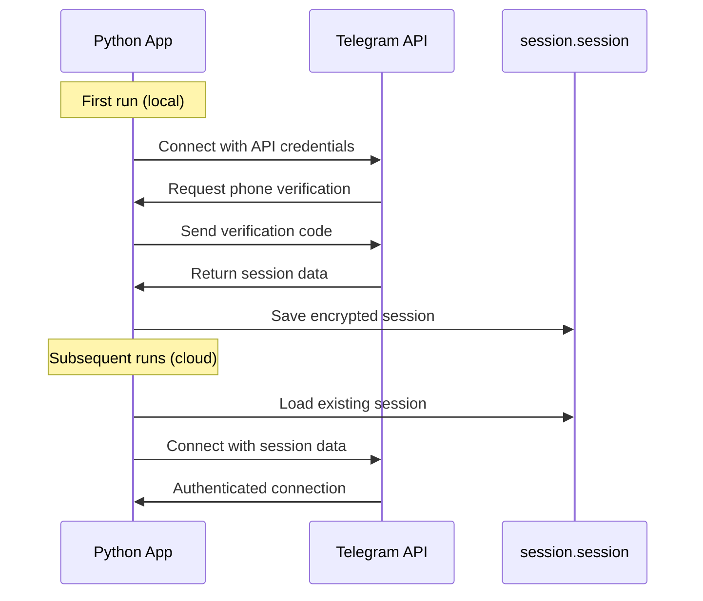

# Telegram to n8n Integration Project Fullstack Architecture Document

## Introduction

This document outlines the complete fullstack architecture for **Telegram to n8n Integration Project**, including the Python listener service (backend), webhook endpoints, n8n workflow integrations, and their seamless integration. It serves as the single source of truth for AI-driven development, ensuring consistency across the entire technology stack.

This unified approach combines what would traditionally be separate backend and integration architecture documents, streamlining the development process for this modern serverless application where message processing, webhook delivery, and workflow automation are tightly coupled.

### Starter Template or Existing Project

**N/A - Greenfield project** - This is a custom Python application built from scratch using Telethon for Telegram integration, designed specifically for Render.com deployment with n8n webhook integration.

### Change Log

| Date | Version | Description | Author |
|------|---------|-------------|--------|
| 2024-01-15 | 1.0 | Initial architecture document | Winston (Architect) |

## High Level Architecture

### Technical Summary

This architecture implements a **serverless event-driven integration** using Python Telethon as a bridge between Telegram's MTProto API and n8n's webhook system. The solution deploys as a continuous worker service on Render.com, maintaining persistent Telegram sessions while forwarding whitelisted messages via HTTP POST to trigger downstream automation workflows. The system emphasizes **security through chat whitelisting**, **minimal operational overhead**, and **real-time message processing** with built-in error handling and logging for production reliability.

### Platform and Infrastructure Choice

**Platform:** Render.com (Worker Service)  
**Key Services:** Background Worker, Environment Variables, GitHub Integration, Build/Deploy Pipeline  
**Deployment Host and Regions:** US-East (Primary), with automatic failover capabilities  
**n8n Integration:** Cloud-hosted n8n instance with webhook endpoints

### Repository Structure

**Structure:** Monorepo with separated concerns  
**Monorepo Tool:** Git submodules (lightweight approach for this simple project)  
**Package Organization:** Feature-based separation (listener, webhooks, utilities)

### High Level Architecture Diagram



### Architectural Patterns

- **Event-Driven Architecture:** Real-time message processing with webhook delivery - _Rationale:_ Enables immediate workflow triggering and loose coupling between Telegram and n8n
- **Whitelist Security Pattern:** Application-level access control through chat ID filtering - _Rationale:_ Provides granular security without requiring Telegram bot permissions
- **Persistent Session Pattern:** Local authentication with cloud session file deployment - _Rationale:_ Bypasses interactive authentication limitations on serverless platforms
- **Webhook Delivery Pattern:** HTTP POST integration with timeout and error handling - _Rationale:_ Reliable integration with n8n's webhook trigger system
- **Configuration as Code:** Environment-based configuration management - _Rationale:_ Secure credential handling and environment-specific deployments
- **Fail-Safe Default Pattern:** Empty whitelist blocks all messages by default - _Rationale:_ Security-first approach preventing accidental data exposure

## Tech Stack

### Technology Stack Table

| Category | Technology | Version | Purpose | Rationale |
|----------|------------|---------|---------|-----------|
| **Backend Language** | Python | 3.9+ | Core application logic | Simple syntax, excellent Telegram library support |
| **Telegram Client** | Telethon | 1.29.1 | Telegram MTProto API access | Official library, handles authentication and sessions |
| **HTTP Client** | Requests | 2.31.0 | Webhook delivery to n8n | Standard, reliable, simple to use |
| **Deployment Platform** | Render.com | N/A | Cloud hosting | Zero-config deployment, free tier available |
| **Session Storage** | File System | N/A | Telegram session persistence | Built into Telethon, no external database needed |
| **Configuration** | Environment Variables | N/A | Secure credential storage | Native platform support, no config framework needed |
| **Logging** | Python logging | Built-in | Application monitoring | Simple built-in solution, no external service required |
| **Version Control** | Git/GitHub | N/A | Code repository | Simple integration with Render.com |
| **Process Management** | Render Worker | N/A | Long-running process | Platform handles process management automatically |
| **Error Handling** | Try/Catch blocks | Built-in | Basic error management | Simple Python exception handling |

## Data Models

### TelegramMessage

**Purpose:** Standardized message format for webhook delivery to n8n workflows

**Key Attributes:**
- `message`: string - The actual message text content
- `chat_id`: number - Unique identifier for the Telegram chat/group  
- `sender_id`: number - Unique identifier for message sender
- `date`: string - ISO timestamp when message was sent
- `is_group`: boolean - Whether message came from a group chat
- `is_channel`: boolean - Whether message came from a channel

#### TypeScript Interface
```typescript
interface TelegramMessage {
  message: string;
  chat_id: number;
  sender_id: number; 
  date: string; // ISO 8601 format
  is_group: boolean;
  is_channel: boolean;
}
```

#### Relationships
- No complex relationships needed - this is a simple data transfer object
- Each message is independent and self-contained
- No persistence or linking between messages required

## API Specification

### Webhook Delivery Specification

**Pattern:** Outbound HTTP POST webhook calls (not an inbound API)

**Endpoint:** User-configured n8n webhook URL  
**Method:** POST  
**Content-Type:** `application/json`
**Authentication:** None (relies on n8n webhook URL secrecy)

### Webhook Payload Format

```json
{
  "message": "Hello from Telegram group!",
  "chat_id": -1001234567890,
  "sender_id": 123456789,
  "date": "2024-01-15T14:30:00.000Z",
  "is_group": true,
  "is_channel": false
}
```

### Simple Integration Flow

```
Python App → HTTP POST → n8n Webhook URL → Triggers n8n Workflow
```

## Components

### Telegram Listener

**Responsibility:** Connect to Telegram, authenticate user session, and capture incoming messages from whitelisted chats

**Key Interfaces:**
- `TelegramClient.start()` - Initialize connection with user credentials
- `@client.on(events.NewMessage)` - Event handler for incoming messages
- `event.chat_id`, `event.raw_text` - Message data extraction

**Dependencies:** 
- Telethon library for Telegram MTProto API
- Session file for authentication persistence
- Environment variables for API credentials

**Technology Stack:** Python 3.9+, Telethon 1.29.1, async/await event handling

### Whitelist Filter

**Responsibility:** Security component that validates incoming messages against configured chat ID whitelist

**Key Interfaces:**
- `is_whitelisted(chat_id: int) -> bool` - Whitelist validation check
- `parse_whitelist(env_var: str) -> List[int]` - Environment variable parsing

**Dependencies:**
- TELEGRAM_WHITELIST_CHATS environment variable
- Message handler component for integration

**Technology Stack:** Pure Python, string parsing, integer validation

### Webhook Delivery

**Responsibility:** Format message data as JSON and deliver to n8n webhook endpoint via HTTP POST

**Key Interfaces:**
- `send_to_webhook(message_data: dict) -> bool` - Main delivery function  
- `format_message(event) -> dict` - Transform Telegram event to JSON payload

**Dependencies:**
- Requests library for HTTP calls
- N8N_WEBHOOK_URL environment variable
- Message data from Telegram Listener

**Technology Stack:** Python requests library, JSON serialization, HTTP timeout handling

### Component Diagram



## External APIs

### Telegram MTProto API

- **Purpose:** Access personal Telegram account to receive messages from groups where user is a member
- **Documentation:** https://docs.telethon.dev/ (Telethon wrapper documentation)
- **Base URL(s):** Multiple Telegram data centers (handled automatically by Telethon)
- **Authentication:** API ID + API Hash + Phone number authentication (one-time setup)
- **Rate Limits:** ~20 requests/second (managed automatically by Telethon)

**Key Endpoints Used:**
- Automatic connection management via Telethon client
- Real-time message event streaming (not traditional REST endpoints)

**Integration Notes:** 
- Requires initial interactive authentication to generate session file
- Session file provides persistent authentication without re-entering phone/code
- Telethon handles all MTProto complexity, reconnection, and rate limiting automatically

### n8n Webhook API

- **Purpose:** Trigger n8n workflows by sending message data via HTTP POST
- **Documentation:** https://docs.n8n.io/integrations/trigger-nodes/webhook/
- **Base URL(s):** User's n8n instance URL (e.g., `https://your-n8n.com`)
- **Authentication:** None - webhook URL acts as authentication token
- **Rate Limits:** Depends on n8n hosting (typically generous for personal use)

**Key Endpoints Used:**
- `POST /webhook/telegram` - Receives message data and triggers workflow

**Integration Notes:**
- Webhook URL must be kept secret (acts as authentication)
- n8n automatically parses JSON payload into workflow variables
- No response data needed - fire-and-forget pattern

## Core Workflows

### Main Message Processing Workflow



### Initial Authentication Workflow



### Error Handling Workflow



## Backend Architecture

### Service Architecture

#### Single Process Application
```
main.py
├── Import dependencies (telethon, requests, os, asyncio)
├── Load environment variables  
├── Initialize Telethon client
├── Define message handler function
├── Start client and run forever
└── Handle graceful shutdown
```

#### Application Template
```python
# main.py - Complete application in one file
import os
from telethon import TelegramClient, events
import requests
import asyncio

# Environment configuration
api_id = os.getenv("TELEGRAM_API_ID")
api_hash = os.getenv("TELEGRAM_API_HASH") 
phone = os.getenv("TELEGRAM_PHONE")
n8n_webhook = os.getenv("N8N_WEBHOOK_URL")
whitelist_chats = os.getenv("TELEGRAM_WHITELIST_CHATS", "")

# Parse whitelist (simple string splitting)
allowed_chat_ids = []
if whitelist_chats:
    allowed_chat_ids = [int(chat_id.strip()) for chat_id in whitelist_chats.split(",")]

# Initialize client
client = TelegramClient('session', api_id, api_hash)

@client.on(events.NewMessage(incoming=True))
async def handler(event):
    """Single function handles everything"""
    # Whitelist check
    if allowed_chat_ids and event.chat_id not in allowed_chat_ids:
        return
    
    # Format message  
    message_data = {
        "message": event.raw_text,
        "chat_id": event.chat_id,
        "sender_id": event.sender_id,
        "date": event.date.isoformat(),
        "is_group": event.is_group,
        "is_channel": event.is_channel
    }
    
    # Send webhook
    try:
        response = requests.post(n8n_webhook, json=message_data, timeout=30)
        print(f"Webhook: {response.status_code}")
    except Exception as e:
        print(f"Error: {e}")

async def main():
    """Simple startup and keep running"""
    await client.start(phone=lambda: phone)
    print("Listening for messages...")
    await client.run_until_disconnected()

if __name__ == "__main__":
    asyncio.run(main())
```

### Authentication and Authorization

#### Telegram Authentication Flow


## Unified Project Structure

```plaintext
telegram-n8n-integration/
├── main.py                     # Complete application (single file)
├── requirements.txt            # Python dependencies (2 packages)
├── render.yaml                # Render.com deployment config
├── session.session            # Telegram authentication (generated locally)
├── .env.example               # Template for local environment variables
├── .gitignore                 # Ignore .env (but include session.session)
├── README.md                  # Basic setup instructions
└── docs/
    ├── telegram-n8n-integration.md    # Existing implementation guide
    └── architecture.md                # This architecture document
```

## Development Workflow

### Local Development Setup

#### Prerequisites
```bash
# Required software (minimal setup)
python3 --version    # Python 3.9+
git --version        # Git for version control
# That's it! No Docker, Node.js, or complex tooling needed
```

#### Initial Setup
```bash
# 1. Clone and enter project
git clone https://github.com/your-username/telegram-n8n-integration.git
cd telegram-n8n-integration

# 2. Install dependencies (just 2 packages)
pip install -r requirements.txt

# 3. Create local environment file
cp .env.example .env

# 4. Edit .env with your credentials
# TELEGRAM_API_ID=1234567
# TELEGRAM_API_HASH=your_api_hash_here  
# TELEGRAM_PHONE=+5511999888777
# N8N_WEBHOOK_URL=https://your-n8n.com/webhook/telegram
# TELEGRAM_WHITELIST_CHATS=-1001234567890,123456789

# 5. Run locally for first-time authentication
python main.py
# Enter verification code when prompted
# session.session file will be created automatically

# 6. Commit and push session file (required for cloud deployment)
git add session.session
git commit -m "Add authenticated session file"
git push
```

#### Development Commands
```bash
# Run the service locally
python main.py

# Test with environment variables
TELEGRAM_WHITELIST_CHATS="-1001234567890" python main.py

# Check dependencies
pip list

# Update dependencies (rarely needed)
pip install --upgrade telethon requests
```

### Environment Configuration

#### Required Environment Variables
```bash
# Local Development (.env file)
TELEGRAM_API_ID=1234567
TELEGRAM_API_HASH=abcdef1234567890abcdef1234567890  
TELEGRAM_PHONE=+5511999888777
N8N_WEBHOOK_URL=https://your-n8n-instance.com/webhook/telegram
TELEGRAM_WHITELIST_CHATS=-1001234567890,123456789,-1001987654321

# Cloud Deployment (Render.com dashboard)
# Same variables, but set through Render's environment variable UI
# Never commit .env to git - use .env.example as template
```

## Deployment Architecture

### Deployment Strategy

**Backend Deployment:**
- **Platform:** Render.com Background Worker Service
- **Build Command:** `pip install -r requirements.txt`
- **Start Command:** `python main.py`
- **Deployment Method:** Automatic deployment on git push
- **Runtime:** Python 3.9+ (managed by Render.com)

### CI/CD Pipeline

```yaml
# render.yaml - Complete deployment configuration
services:
  - type: worker
    name: telegram-n8n-listener
    runtime: python
    buildCommand: "pip install -r requirements.txt"
    startCommand: "python main.py"
    envVars:
      - key: TELEGRAM_API_ID
        sync: false
      - key: TELEGRAM_API_HASH
        sync: false  
      - key: TELEGRAM_PHONE
        sync: false
      - key: N8N_WEBHOOK_URL
        sync: false
      - key: TELEGRAM_WHITELIST_CHATS
        sync: false
```

### Environments

| Environment | Service URL | Purpose | Configuration |
|-------------|------------|---------|---------------|
| **Development** | Local machine | Local testing with .env file | Manual python main.py |
| **Production** | Render.com worker | Live message processing | Environment variables in Render dashboard |

---

*This architecture document provides a comprehensive yet simple foundation for the Telegram to n8n Integration Project, optimized for personal use with minimal complexity and maximum reliability.*
